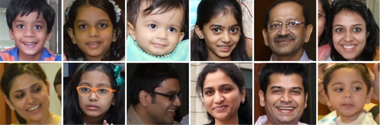

# FaceAI

This package is aim to make using Computer Vision simple as possible.
FaceAI use 2 main features.
1. Creating a Vision Operations Pipe.
2. Creating a Stack Operation over desired photos.

# Requirement
- iOS 13.0+
- Swift 5.1+
- Xcode 12.0+

# Install
SPM:
```
dependencies: [
  .package(
      url:  "https://github.com/LA-Labs/FaceAI.git",
      .branch("master")
  )
]
```
# Usage

## Import
###### Import FaceAI Module to your class
```swift 
import FaceAI
```

## Basic Usage
###### Face detection over the photos gallery
```swift 
// Create default fetch options
let options = AssetFetchingOptions()

// Create image processing request
let faceRectangle = VFilter.faceRectangle()
FaceAI.detect(faceRectangle, with: options) { (result) in
   switch result {
   // The result type is ProcessedAsset
   // Containt all photos with face recatangle detection
   // photos[0].boundingBoxes
      case .success(let photos):
          print(photos)
      case .failure(let error):
          print(error)
   }
}
```

###### Fetch options
```swift 
let options = AssetFetchingOptions(sortDescriptors: [NSSortDescriptor]?,
                                   assetCollection: AssetCollection,
                                   fetchLimit: Int)
```

###### Asset Collections
```swift
public enum AssetCollection {
    case allAssets
    case albumName(_ name: String)
    case assetCollection(_ collection: PHAssetCollection)
    case identifiers(_ ids: [String])
}
```


## Multiple Requests
###### Creating a pipe process
```swift
// Creating Face rectangle dection
let faceRectangle = VFilter.faceRectangle()
        
// Creation Object Dection.
// Sky, flower, water etc.
let objectDetecting = VFilter.objectDetecting()

// Combine to pipe processing
// Every image will go through the pipe.
let pipeProcessing = faceRectangle |>> objectDetecting
FaceAI.detect(pipeProcessing, with: options) { (result) in
switch result {
   // The result type is ProcessedAsset
   // Containt all photos with face recatangle detection
   // photos[0].boundingBoxes
   // photos[0].tags
      case .success(let photos):
          print(photos)
      case .failure(let error):
          print(error)
   }
}
```

# Face Grouping



###### Collect people faces into groups
```swift
// Create photo fetech options
let options = AssetFetchingOptions()
        
// Create cluster options
let clusterOptions = ClusterOptions()
FaceAI.cluster(fetchOptions: options,
               culsterOptions: clusterOptions) { (result) in
     // Result contian group faces
     // [Int: [Face]]
     // Key = group id
     // Value = Same people faces
     switch result {
        case .success(let faces):
           print(faces)
        case .failure(_):
           break
     }
}
```
